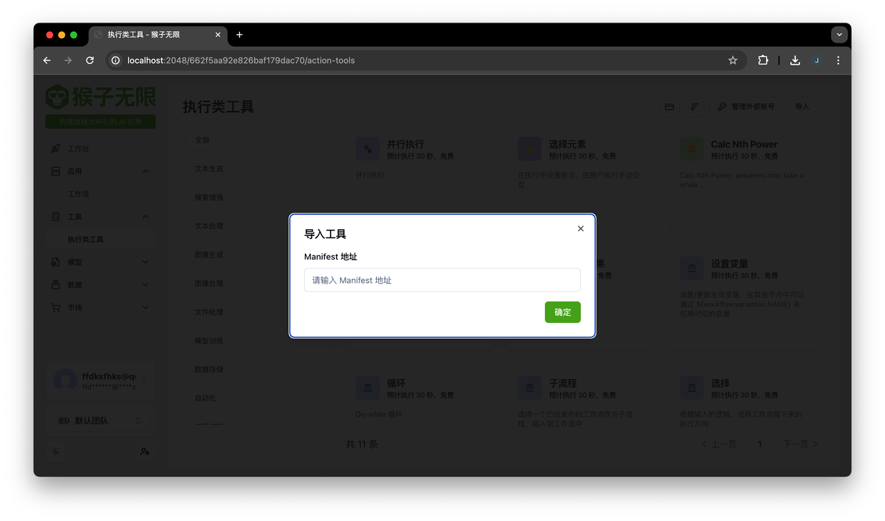

# ✨ Monkey Tools Template for Flask

Read the tourial at [https://inf-monkeys.github.io/docs/zh-cn/tools/custom-tools/](https://inf-monkeys.github.io/docs/zh-cn/tools/custom-tools/)

## 💻 Local Developer

1. Clone the repository

    ```bash
    git clone https://github.com/inf-monkeys/monkey-tools-tempalte-flask
    ```

2. Go into repository folder

    ```bash
    cd monkey-tools-tempalte-flask
    ```

3. Install python dependencies:

    ```bash
    python -m venv venv
    source venv/bin/activate
    pip install -r requirements.txt
    ```

4. Start the API Server:

    ```bash
    python main.py
    ```

    You can now access the app on [http://localhost:5000](http://localhost:5000)

## Import tool

You can import this tool at the dashboard:


